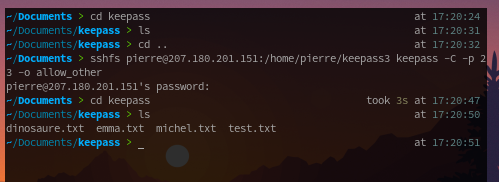

# TP3 : Attaques sur les mots de passe
## Mise en oeuvre et utilisation d'un gestionnaire de mots de passe, usage avancé

## Classe : B3B
## Élèves : Emma Durand **[@emmadrd912](https://github.com/emmadrd912)** et Pierre Ceberio **[@PierreYnov](https://github.com/PierreYnov)** 


# Sommaire 

- [Le Lab](#le-lab)
- [Découverte et utilisation de sshfs]()
- [Découverte et utilisation de syncthing]()


## Le lab

- poste avec keepass
- serveur distant Linux

## Découverte et utilisation de sshfs 

    - configurer un access ssh sur le serveur linux :
    - activer le strictmode de ssh
    - desactiver les connexions distantes depuis root
    - modifier le port par default de ssh
    - créer un user sur le serveur avec un mdp fort et devra avoir accès au répertoire de keepass


On ``vi /etc/ssh/sshd_config`` et ligne 35 on décommente la ligne ``StrictModes yes``

On ``vi /etc/ssh/sshd_config`` et ligne 34 on met ``PermitRootLogin`` en ``no``

On ``vi /etc/ssh/sshd_config`` et ligne 15 on décommente ``Port`` et on met ``23``

On crée un utilisateur ``useradd -m pierre`` et je lui donne comme mot de passe avec ``passwd pierre`` : 

``AJ@b9R-g7ZZ^cVd+``


    - installer sshfs sur le client.
    - le configurer pour qu'il monte dans l'arborescence du dossier contenant la base.

``apt get install sshfs``

On ajoute sur le serveur, l'utilisateur pierre au groupe guse

``sudo groupadd fuse``

``usermod -a -G fuse pierre``

Pour autoriser l'accès aux utilisateurs non-root, il faut décommenter la ligne ```user_allow_other``` dans le fichier ```/etc/fuse.conf```.

``sshfs pierre@207.180.201.151:/home/pierre/keepass3 keepass -C -p 23 -o allow_other``





C'est fonctionnel !

## Découverte et utilisation de syncthing

- installer et configurer syncthing pour que le dossier contenant les bases de mot de passe keepass soit synchronisé.